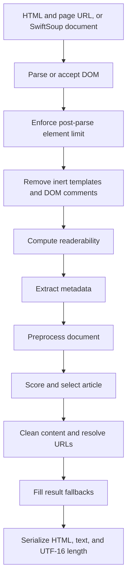

# SwiftReadability architecture

SwiftReadability is a native Swift article-extraction library. This document
describes the production boundary, extraction pipeline, state model, and design
decisions that are intentionally kept out of the project README.

For corpus results and test methodology, see [Benchmark and
verification](BENCHMARK.md). For source and license lineage, see [Provenance and
licensing](docs/provenance-and-licensing.md).

## Purpose and boundaries

The production library accepts an HTML snapshot or an existing SwiftSoup
document plus the page URL. It identifies and cleans the primary readable
content, extracts metadata, resolves relative URLs, and returns HTML and text.

SwiftReadability does not:

- fetch webpages;
- render CSS or execute JavaScript;
- provide a browser DOM or WebKit integration;
- crawl websites; or
- sanitize extracted HTML for safe display.

The default, extension-free mode targets semantic compatibility with the pinned
Mozilla Readability baseline. Optional extensions are explicit package policy
for publisher patterns where a client deliberately wants additional recovery or
cleanup.

## Package topology

| Target or product | Role | Production dependency |
| --- | --- | --- |
| `SwiftReadability` | Public native extraction library | SwiftSoup and WebURL |
| `SwiftReadabilityJavaScriptReference` | Optional, pinned Mozilla JavaScript resources | None from `SwiftReadability` |
| `SwiftReadabilityFixtureSupport` | Shared fixture loading for development executables | Not a published library product |
| `SwiftReadabilityContract` | JSON bridge used by the direct differential | `SwiftReadability` and fixture support |
| `SwiftReadabilityBench` | Deterministic fixture benchmark harness | `SwiftReadability` and fixture support |
| `SwiftReadabilityTests` | Native API, fixture, regression, and semantic tests | Development only |

An application selecting only the `SwiftReadability` product links native Swift
code, SwiftSoup, and WebURL. It does not link the optional Mozilla resources,
Node, JSDOM, or the JavaScript test runner.

SwiftSoup provides HTML parsing and DOM operations. WebURL provides WHATWG URL
parsing and relative-reference resolution that more closely follows browser
behavior than Foundation's legacy URL rules.

## Public API boundary

`Readability` is the extraction facade:

- `Readability(html:url:options:)` stores source HTML and builds a fresh DOM for
  each parse.
- `Readability(document:options:)` operates directly on the supplied SwiftSoup
  document and destructively normalizes it.
- `parse()` returns `ReadabilityResult` with metadata, readable HTML, text,
  JavaScript-compatible UTF-16 length, and the preflight readerability result.
- `parse(serializer:)` projects the extracted element into a caller-defined
  content type.
- `isProbablyReaderable` is an inexpensive heuristic. It is not a correctness
  gate and may return false positives or false negatives.

The mutable `Article` type remains for source compatibility. New extraction
code should prefer `ReadabilityResult` or `ReadabilitySerializedResult`.

Timing APIs are exposed only through the `Bench` SPI. Their stage labels are
diagnostic implementation details, not a stable public protocol.

## Extraction pipeline

The order of the main stages is an architectural invariant:

### 1. Parse and bound the document

HTML-backed readers parse with the supplied page URL as the document location.
Document-backed readers use the SwiftSoup document's existing location, falling
back to `about:blank` when it is empty.

`maxElemsToParse` is enforced after SwiftSoup has parsed the DOM. It limits later
extraction work, but it is not a parser memory or input-byte limit.

### 2. Normalize inert DOM data

HTML `<template>` payloads are removed before selectors, metadata, and scoring
run because their contents are not reader-visible browser content. Actual DOM
Comment nodes are also removed so framework separator comments cannot split
continuous prose. Comment-like text inside scripts, styles, and JSON-LD remains
ordinary element data.

### 3. Capture pre-mutation signals

Readerability is computed before destructive extraction. Metadata is collected
before preprocessing removes scripts and other source signals, allowing JSON-LD,
Open Graph, and document metadata to participate when enabled.

### 4. Preprocess

`Preprocessor` handles source normalization needed before scoring, including
script and style removal, legacy element conversion, consecutive ` ` runs,
`noscript` image recovery, and any explicitly enabled early extensions.

### 5. Select the article

`ArticleGrabber` prepares candidate nodes, scores text-bearing ancestors,
selects the strongest candidate, gathers qualifying siblings, and conditionally
cleans the resulting subtree. When retained content falls below
`charThreshold`, it retries with progressively less aggressive scoring and
cleanup flags, following Mozilla's fallback model.

Candidate scores and DOM identity caches live for one extraction invocation.
They are not retained across repeated calls on an HTML-backed reader.

### 6. Postprocess and return

`Postprocessor` resolves links and media URLs through WebURL, simplifies nested
elements, and applies the requested class-preservation policy. The facade then
fills supported excerpt and document signals, serializes the article subtree,
collects DOM text in document order, and reports its length in UTF-16 code units
to match JavaScript `String.length`.

## Default behavior and extensions

Most `ReadabilityOptions` fields correspond to Mozilla options, including
candidate counts, character thresholds, class policy, JSON-LD behavior, video
allowlisting, link density, serializers, and element limits.

Two areas are native Swift policy:

- `useXMLSerializer` requests SwiftSoup XML syntax only for an XML input. It is
  not a Mozilla option and does not promise generic browser-DOM namespace
  parity.
- `extensions` enables granular publisher adaptations. The empty set is the
  default and the only mode used for the complete Mozilla fixture differential.

Available extensions cover image-carousel recovery, publisher-chrome cleanup,
article-body preservation, significant-media preservation, and ruby
normalization. There is no public aggregate preset; consuming applications own
the policy combination they enable and version.

A caller-supplied `allowedVideoRegex` retains Foundation
`NSRegularExpression` semantics. Tests compare only the reviewed regular-
expression subset shared with ECMAScript; the package does not attempt to
translate arbitrary expressions between the two dialects.

## State, mutation, and concurrency

HTML-backed readers construct a fresh DOM for every parse and are designed to
produce deterministic repeated output. Document-backed readers mutate the
supplied DOM in place and should be treated as single-use.

`Readability` is intentionally not `Sendable`. Create and use an instance within
one task or actor. Result structures are `Sendable` when their generic content
is `Sendable`.

The generic serializer receives the detached extracted article element. Text,
length, metadata, and readerability are captured according to the documented
result contract so serializer mutation cannot retroactively redefine those
fields.

## Browser-semantics adapters

The implementation keeps compatibility shims narrow and tied to observable
reader output:

| Concern | Primary implementation |
| --- | --- |
| URL parsing and relative resolution | `BrowserURLContext.swift`, WebURL |
| ECMAScript whitespace and numbers | `ECMAScriptText.swift`, `ECMAScriptNumber.swift` |
| JavaScript string length | `JavaScriptStringLength.swift` |
| Bounded inline-style visibility | `InlineStyleDeclarations.swift` |
| HTML, SVG, and MathML content namespaces | `ArticleContentNamespace.swift` |
| Article subtree serialization | `ArticleHTMLSerializer.swift` |
| Table classification and cleanup | `TableDimensions.swift` |

The goal is semantic output compatibility, not an in-Swift recreation of every
browser object, error message, serializer spelling, or JSDOM accident.

## Quality priorities

When compatibility and reader-visible quality pull in different directions,
the implementation uses these priorities:

1. Preserve genuine prose and article structure.
2. Preserve useful metadata, meaningful media, and correctly resolved URLs.
3. Remove navigation, advertisements, controls, paywalls, and repeated chrome.
4. Remain deterministic and bounded on malformed or adversarially large DOMs.
5. Match Mozilla's semantic result across the complete compatibility corpus.

The default bias is to retain inert prose when evidence is ambiguous. Active
embeds, advertising, and page controls require affirmative evidence to survive.
A narrow intentional difference needs a focused regression; implementation
identity alone does not justify production complexity.

## Verification architecture

The pinned Mozilla JavaScript is an executable development oracle, not a
production dependency. The JavaScript runner executes Mozilla in JSDOM, while
`SwiftReadabilityContract` emits the native result in the same JSON contract.
The comparator checks scalar fields exactly and parses normal HTML content into
a canonical DOM tree.

This keeps three evidence layers separate:

1. native expected-output and focused regression tests;
2. JavaScript oracle and integrity tests; and
3. direct Swift-versus-Mozilla semantic comparison.

The corpus, comparator, current results, commands, and limitations are
documented in [Benchmark and verification](BENCHMARK.md).

## Source map

| Area | Files |
| --- | --- |
| Public facade and models | `Readability.swift`, `Models.swift` |
| Metadata | `MetadataParser.swift` |
| Source normalization | `Preprocessor.swift` |
| Candidate selection and cleanup | `ArticleGrabber.swift`, `ProcessorBase.swift`, `RegExUtil.swift` |
| Final URL and DOM cleanup | `Postprocessor.swift` |
| Browser-semantics adapters | `BrowserURLContext.swift`, `ECMAScript*.swift`, `JavaScriptStringLength.swift`, `InlineStyleDeclarations.swift`, `TableDimensions.swift` |
| DOM fidelity and serialization | `ArticleContentNamespace.swift`, `ArticleHTMLSerializer.swift` |
| Opt-in publisher policy | `ImageCarouselNormalizer.swift`, `PublisherChromeCleaner.swift` |

Public API changes follow Semantic Versioning. Before 1.0, incompatible public
API changes are reserved for minor releases; patch releases remain source-
compatible. Changes to the Mozilla, SwiftSoup, or WebURL baselines must pass the
complete unfiltered verification gates and be recorded in the changelog.
